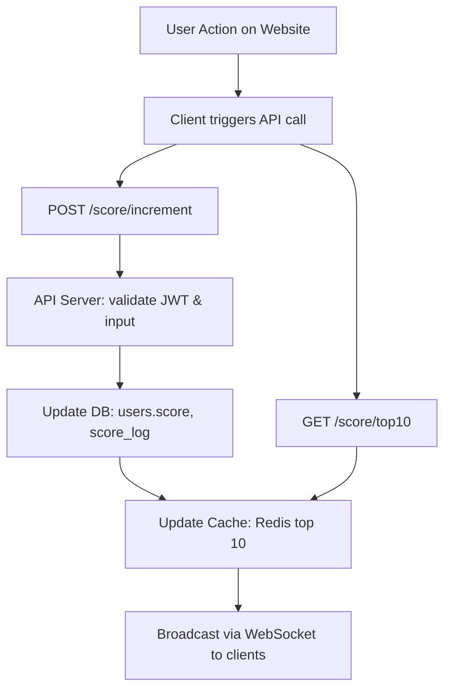

# Scoreboard Service - Backend Module

## Table of Contents

1. [Overview / Purpose](#overview--purpose)
2. [Functional Requirements](#functional-requirements)
3. [API Specification](#api-specification)
4. [Database Schema](#database-schema)
5. [Flow / Sequence Diagram](#flow--sequence-diagram)
6. [Security Measures](#security-measures)
7. [Future Improvements / Ideas](#future-improvements--ideas)
8. [Research / References](#research--references)
9. [Tech Stack](#tech-stack)

---

## Overview / Purpose

This module implements a **real-time scoreboard** service for a website.
It maintains top user scores and allows live updates upon user actions.

**Goals:**

- Provide top 10 users leaderboard.
- Update scores in real-time.
- Ensure security to prevent score tampering.
- Be scalable and maintainable for high load.

---

## Functional Requirements

1. Users perform actions on the website (any action type).
2. Each action triggers an **API call** to increment the user’s score.
3. Scoreboard displays **Top 10 users** with live updates.
4. Authorization is enforced to prevent malicious score manipulation.

---

## API Specification

### 1️⃣ Increment User Score

**POST** `/score/increment`
**Headers:** `Authorization: Bearer <JWT>`
**Body:**

```json
{
  "userId": 123,
  "deltaScore": 10
}
```

**Responses:**

- 200 OK → `{ "userId": 123, "newScore": 120 }`
- 401 Unauthorized → invalid/missing token
- 400 Bad Request → invalid input

### 2️⃣ Get Top 10 Scoreboard

**GET** `/score/top10`
**Headers:** optional `Authorization: Bearer <JWT>`

**Response:**

```json
[
  { "userId": 1, "name": "Alice", "score": 500 },
  { "userId": 2, "name": "Bob", "score": 480 },
  ...
]
```

---

## Database Schema

**Users Table**

```sql
CREATE TABLE users (
  id SERIAL PRIMARY KEY,
  name TEXT NOT NULL,
  score INT DEFAULT 0
);
```

**Score Log Table**

```sql
CREATE TABLE score_log (
  id SERIAL PRIMARY KEY,
  user_id INT REFERENCES users(id),
  delta_score INT NOT NULL,
  created_at TIMESTAMP DEFAULT NOW()
);
```

---

## Flow / Sequence Diagram

**Mermaid diagram**



**Diagram Image:** [diagram.png](./docs/diagram.png)

---

## Security Measures

- JWT Authentication for each request
- Input validation to prevent injection
- Rate limiting to prevent score spam
- Server-side verification for valid user actions
- Optional: logging suspicious activities

---

## Future Improvements / Ideas

See [`ideas.md`](./docs/ideas.md) for optional features, performance, and additional security improvements.

---

## Research / References

See [`research.md`](./docs/research.md) for references on WebSocket, Redis caching, PostgreSQL usage, and anti-cheat strategies.

---

## Tech Stack

- Node.js + Express
- PostgreSQL for persistent storage
- Redis for caching top scores
- WebSocket (or SSE) for live updates
- Optional: message queue (RabbitMQ/Kafka) for async processing
